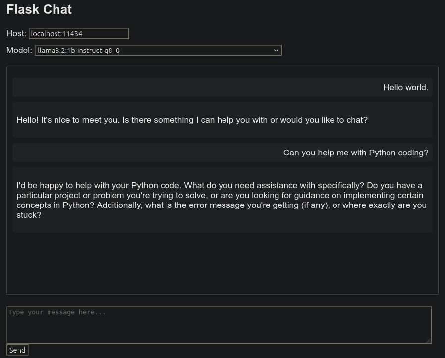

# Ollama Flask Chat
A very simple Flask powered LLM chat app that uses a locally running ollama server and models.



## Features
- Completely local LLM chat app.
- Uses your locally running Ollama server and models.
- Can specify Ollama on another server and port.
- Can select any installed model.
- Keeps a model chat history.

## Roadmap
- File upload.
- Image upload.
- Nicer UI.

***NOTE*** This project will never be Open WebUI. I have very little time and
expect new features to be added slowly. It is meant to be very simple and
lightweight, something that is easy to install, manage and use with as few
requirements as possible.

## Prerequisites
- python3.9+.  May work with older versions but untested.
- venv with pip highly recommended.
- ollama installed and `ollama serve` running somewhere.
- At least one GGUF model installed.

## Installation

1. **Clone the Repository**

   ```
   git clone git@github.com:fastzombies/ollama-flask-chat.git
   cd ollama-flask-chat
   ```

2. **Create and Activate Virtual Environment**

   ```
   mkdir venv && cd venv
   python3 -m venv ollama-flask-chat
   cd ../..
   source venv/ollama-flask-chat-env/bin/activate
   ```

3. **Install Dependencies**

   ```
   pip install -r requirements.txt
   ```

4. **Start Ollama Serve**

   Make sure you have the Ollama installed locally. Follow the instructions on [Ollama's website](https://ollama.com/download) to set it up.

   Start the Ollama Server:

   ```
   ollama serve
   ```

## Running the Application

1. **Start the Flask Application**

   ```
   ./ollama-flask-chat.py
   ```
   or
   ```
   python3 ollama-flask-chat.py
   ```

2. **Access the Application**

   Open your web browser and navigate to `http://127.0.0.1:5000/` or `http://<your-local-ip>:5000/` to access the application from another device on the same network. Ctrl-C to stop Flask.


## Usage

1. **Chat with the AI**
    - Check your Host field. Uses `OLLAMA_HOST` environment variable as default.
    - Select a model.
    - Enter your prompt in the prompt box and click "Send".
    - The AI response will appear in the chat window.

1. **Switch Models**
    - At any time you may switch models if there is more than one model installed.
    - Any chat history with that model will be loaded on selection.

## Privacy and Data Security

- All processing happens locally on your machine.
- No data is sent to external servers unless you speify one.
- Chat history are stored in your home directory `~/.flask-chat`.

## Troubleshooting

- If you encounter issues with the AI responses, ensure that `ollama serve` is running locally by running it CLI with `ollama run <your model name>`.
- Check the console for any error messages if the application isn't behaving as expected.

## Contributing

Contributions are welcome! Please feel free to submit a Pull Request.

## License

This project is licensed under the GNU GENERAL PUBLIC LICENSE Version 3, 29 June 2007